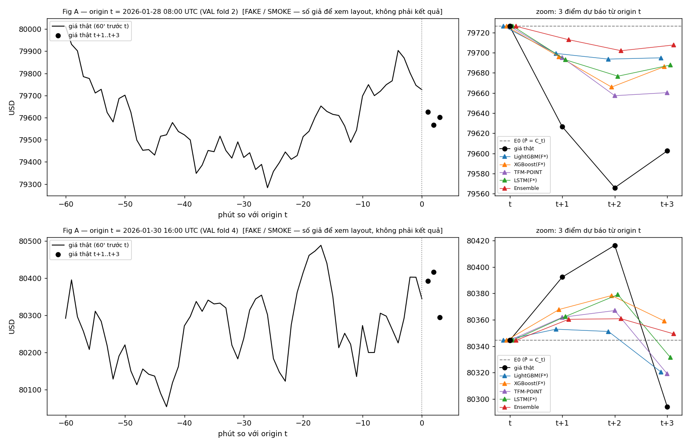
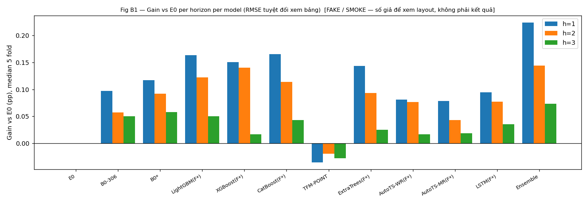
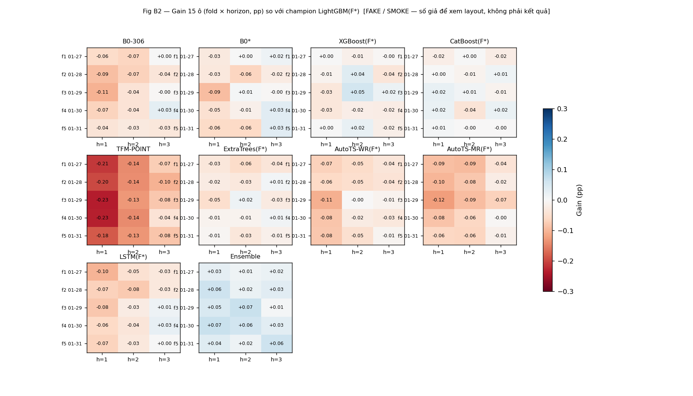
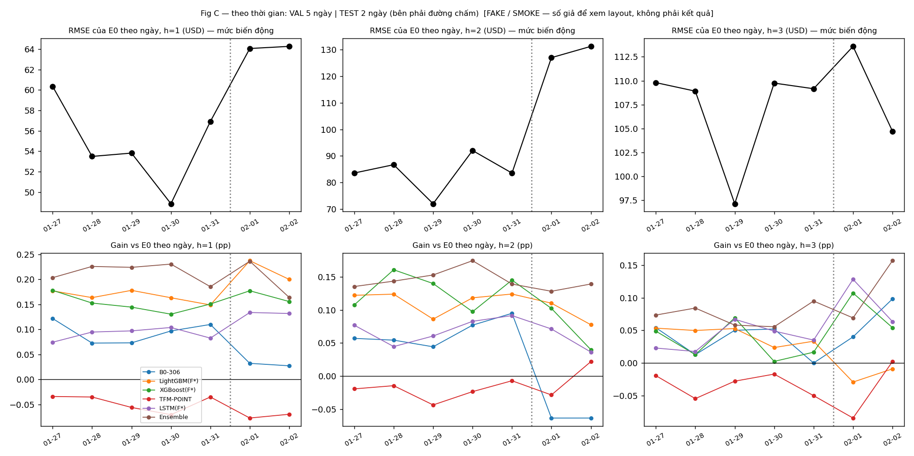

# SMOKE VISUALIZE — layout bảng/figure theo plan (SỐ GIẢ)

> **FAKE / SMOKE — số giả để xem layout, không phải kết quả.** Sinh bởi `reports/smoke_visualize.py` (seed 8586), không đọc data thật, không train gì. Mục đích: thống nhất *hình dạng* output của từng bước trong `docs/RESEARCH_PLAN.md` trước khi code. Mọi con số dưới đây sẽ bị thay bằng kết quả thật khi chạy; không được trích dẫn như finding.

Quy ước chung: prediction là log-return `ŷ_h`, metric tính trên **giá** `P̂ = C_t·exp(ŷ_h)` (USD); `Gain = 1 − RMSE_cand/RMSE_base` tính bằng **pp** (0.100 pp = RMSE thấp hơn base 0.1%); 15 ô = 5 fold × 3 horizon; E0 = dự báo giá không đổi (`P̂ = C_t`).

## 1. §1.3 — Nhiễu seed ε_m và số vòng cố định

| model | std_seed (pp) | ε_m = max(0.005, std) (pp) |
|---|---|---|
| LightGBM | 0.021 | 0.021 |
| XGBoost | 0.024 | 0.024 |
| CatBoost | 0.019 | 0.019 |
| ExtraTrees | 0.015 | 0.015 |
| AutoTS-WR | 0.031 | 0.031 |
| AutoTS-MR | 0.034 | 0.034 |
| LSTM | 0.058 | 0.058 |

**Giải thích.** Mỗi model chạy 3 seed trên feature baseline; `std_seed` là độ lệch chuẩn của Gain giữa các seed trên 15 ô; `ε_m` là ngưỡng "tệ hơn" dùng cho KEEP/DROP và champion của model đó. LSTM nhiễu seed lớn hơn tree, nên ngưỡng của nó rộng hơn — tự động, không chỉnh tay.

Số vòng cố định của LightGBM (best_iteration lấy từ run baseline có ES, dùng cho mọi candidate):

| fold | h=1 | h=2 | h=3 |
|---|---|---|---|
| fold 1 (VAL 01-27) | 394 | 446 | 226 |
| fold 2 (VAL 01-28) | 160 | 315 | 394 |
| fold 3 (VAL 01-29) | 426 | 325 | 303 |
| fold 4 (VAL 01-30) | 275 | 203 | 443 |
| fold 5 (VAL 01-31) | 298 | 379 | 207 |

**Giải thích.** ES trên 1.377 dòng làm best_iteration nhiễu, nên chỉ lấy một lần ở baseline rồi cố định; candidate và baseline cùng số vòng ⇒ chênh lệch Gain chỉ do feature. Run confirmation cuối bật lại ES.

## 2. §1.4 — Lọc 306 feature B0 → B0\* (`experiments/b0_filter.csv`)

Mẫu 8 dòng (thật sẽ có 306 dòng):

| cột | base | lag | PI h1/h2/h3 (USD) | standalone Gain vs E0 h1/h2/h3 (pp) | standalone Gain vs B0-306 (pp, median) | MI − null h1/h2/h3 (nat) | tier | B0* (R2) |
|---|---|---|---|---|---|---|---|---|
| fine:t:return1 | return1 | 0 | +1.13/+0.47/+1.08 | +0.054/+0.073/+0.066 | -0.149 | +0.0040/+0.0035/+0.0046 | — | giữ |
| fine:t-1m:return1 | return1 | -1 | +1.41/+0.86/+1.32 | +0.017/+0.085/+0.033 | -0.135 | +0.0030/+0.0038/+0.0040 | — | giữ |
| fine:t:close_position | close_position | 0 | +0.77/+0.92/+1.04 | +0.065/+0.033/+0.026 | -0.076 | +0.0039/+0.0053/+0.0034 | — | giữ |
| coarse:t:rv64 | rv64 | 0 | +0.85/+0.77/+1.30 | +0.081/+0.043/+0.042 | -0.046 | +0.0049/+0.0057/+0.0045 | — | giữ |
| coarse:t-504m:time_of_day_sin | time_of_day_sin | -504 | -0.06/+0.07/-0.22 | -0.010/-0.012/-0.017 | -0.137 | -0.0025/-0.0004/+0.0005 | — | giữ |
| fine:t-63m:minute_mod5_cos | minute_mod5_cos | -63 | -0.65/-0.25/-0.06 | -0.034/+0.007/-0.016 | -0.117 | -0.0020/+0.0013/+0.0006 | — | giữ |
| coarse:t-256m:sign_flip_rate32 | sign_flip_rate32 | -256 | +0.21/+0.18/-0.01 | -0.032/+0.003/-0.016 | -0.160 | +0.0002/-0.0026/-0.0016 | — | giữ |
| origin:rv60 | rv60 | 0 | +0.62/+0.68/+1.07 | +0.047/+0.042/+0.071 | -0.114 | +0.0042/+0.0040/+0.0043 | — | giữ |

Kiểm chứng 3 bộ lọc so với B0-306 (mỗi bộ 1 run, số vòng cố định, seed 8586):

| bộ | số cột | MedianGain vs B0-306 (pp) | WinRate | quyết định |
|---|---|---|---|---|
| B0-306 | 306 | 0.000 | — | reference |
| R1 = B0 − Tier1 | 245 | +0.020 | 0.60 | không tệ hơn |
| R2 = B0 − Tier1 − Tier2 | 197 | +0.031 | 0.67 | **B0\*** (cao nhất, ≥ −ε) |
| R3 = chỉ PI > 0 | 143 | −0.044 | 0.33 | tệ hơn ε_LGBM = 0.021 → loại |

**Giải thích.** PI = RMSE tăng thêm (USD) khi xáo cột đó trong VAL (≤ 0 → model không dùng cột hữu ích); standalone = LightGBM chỉ trên một cột, Gain so với E0 và so với B0-306 (nếu một cột thắng B0-306 → cờ đỏ B0 bị nhiễu); MI − null = mutual information với z-target trên FIT trừ MI với target xáo trộn. Một cột *fail* một tiêu chí khi fail ở cả 3 horizon. Tier 1 = fail cả ba; Tier 2 = PI ≤ 0 + một tiêu chí nữa; R3 = chỉ giữ PI > 0. Chọn B0\* = bộ không tệ hơn B0-306 có MedianGain cao nhất (ở mẫu này là R2, 197 cột). Bảng nhóm 38 base feature (gộp 8 lag) đi kèm để đọc, không dùng để quyết định.

## 3. §2.1 — Vòng lặp feature của một model (`experiments/keepdrop_LightGBM.csv`)

Mẫu 8 candidate đầu (thật: 39 dòng/model, mỗi model một file):

| # | cột | MedianGain vs S_m (pp) | WinRate | P10Gain | WorstGain | Gain vs B0* (pp) | Gain vs E0 (pp) | gain_standalone vs E0 (pp) | decision | |S_m| sau | exp_id |
|---|---|---|---|---|---|---|---|---|---|---|---|
| 1 | vwap_amt_gap_1 | +0.041 | 0.73 | -0.021 | -0.030 | +0.045 | +0.165 | +0.034 | KEEP | 198 | lgbm_c001 |
| 2 | vwap_amt_gap_15 | +0.012 | 0.73 | -0.042 | -0.078 | +0.019 | +0.140 | +0.013 | KEEP | 199 | lgbm_c002 |
| 3 | vwap_amt_gap_60 | -0.009 | 0.27 | -0.084 | -0.113 | +0.002 | +0.122 | -0.018 | KEEP | 200 | lgbm_c003 |
| 4 | vwap_amt_gap_240 | -0.033 | 0.13 | -0.106 | -0.134 | -0.018 | +0.102 | +0.020 | DROP | 200 | lgbm_c004 |
| 5 | ret_60 | +0.002 | 0.53 | -0.054 | -0.067 | +0.021 | +0.141 | -0.007 | KEEP | 201 | lgbm_c005 |
| 6 | ret_240 | -0.018 | 0.40 | -0.114 | -0.124 | +0.005 | +0.124 | +0.009 | KEEP | 202 | lgbm_c006 |
| 7 | ret_1440 | -0.052 | 0.20 | -0.137 | -0.151 | -0.026 | +0.094 | +0.013 | DROP | 202 | lgbm_c007 |
| 8 | log_rv15_rv240 | +0.024 | 0.80 | -0.054 | -0.115 | +0.054 | +0.174 | +0.021 | KEEP | 203 | lgbm_c008 |

**Giải thích.** Mỗi dòng = một candidate thêm vào bộ hiện tại `S_m` của model; base của Gain là chính model trên `S_m`. Luật: `MedianGain ≥ −ε_m` → KEEP (kể cả gần như không đổi), `< −ε_m` → DROP (ε_LGBM giả = 0.021 pp). `gain_standalone` là diagnostic (LightGBM chỉ trên cột đó vs E0): standalone > 0 nhưng vs S_m ≈ 0 ⇒ có tín hiệu nhưng trùng base. `|S_m| sau` cho thấy bộ feature lớn dần; cuối vòng lặp có safety-net (thử lại block các cột DROP) và prune permutation ≤ 0.

## 4. §3 — Champion log (`experiments/champion_log.csv`)

| model | F*_m (số cột ext KEEP) | champion trước | MedianGain vs champion (pp) | WinRate | P10Gain | WorstGain | ε_champion | decision | latency p50 h1 (ms) | champion sau |
|---|---|---|---|---|---|---|---|---|---|---|
| LightGBM(F*) | 14 | — | — | — | — | — | 0.021 | champion ban đầu (§3) | 0.35 | LightGBM(F*) |
| XGBoost(F*) | 14 | LightGBM(F*) | -0.011 | 0.40 | -0.033 | -0.037 | 0.021 | giữ | 0.60 | LightGBM(F*) |
| CatBoost(F*) | 17 | LightGBM(F*) | +0.000 | 0.53 | -0.021 | -0.038 | 0.021 | giữ | 0.25 | LightGBM(F*) |
| TFM-POINT | — | LightGBM(F*) | -0.139 | 0.00 | -0.225 | -0.235 | 0.021 | giữ | 28.00 | LightGBM(F*) |
| ExtraTrees(F*) | 20 | LightGBM(F*) | -0.024 | 0.20 | -0.045 | -0.056 | 0.021 | giữ | 9.00 | LightGBM(F*) |
| AutoTS-WR(F*) | 16 | LightGBM(F*) | -0.048 | 0.00 | -0.081 | -0.107 | 0.021 | giữ | 180.00 | LightGBM(F*) |
| AutoTS-MR(F*) | 22 | LightGBM(F*) | -0.069 | 0.00 | -0.097 | -0.125 | 0.021 | giữ | 260.00 | LightGBM(F*) |
| LSTM(F*) | 23 | LightGBM(F*) | -0.036 | 0.20 | -0.080 | -0.103 | 0.021 | giữ | 2.40 | LightGBM(F*) |
| Ensemble | 14 | LightGBM(F*) | +0.034 | 1.00 | +0.014 | +0.005 | 0.021 | **đổi** | — | Ensemble |

**Giải thích.** Champion ban đầu = LightGBM code gốc trên F\*_LGBM (dòng đầu, không so sánh). Sau khi mỗi model xong vòng lặp + confirmation 3 seed, so với champion hiện tại bằng Gain trên giá 15 ô; `MedianGain > +ε_champion` → đổi champion, ngược lại giữ — cả hai trường hợp đều ghi một dòng. Ensemble xét cuối cùng, cùng luật (ở mẫu này Ensemble thắng ⇒ champion cuối = Ensemble). Cột latency chỉ là thông tin (§7.4), không phải tiêu chí.

## 5. §7.2 — Bảng tổng hợp mọi model (`experiments/summary/all_models.csv`)

### 5.1 VAL (5 fold gộp; RMSE/MAE = trung bình fold; Gain 15 ô)

| model | RMSE h1 (USD) | MAE h1 | r h1 | dir-acc h1 | Gain vs E0 h1 (pp) | RMSE h2 (USD) | MAE h2 | r h2 | dir-acc h2 | Gain vs E0 h2 (pp) | RMSE h3 (USD) | MAE h3 | r h3 | dir-acc h3 | Gain vs E0 h3 (pp) | MedianGain vs B0-306 (pp) | WinRate vs B0-306 | MedianGain vs champion (pp) | P10 vs champion | Worst vs champion |
|---|---|---|---|---|---|---|---|---|---|---|---|---|---|---|---|---|---|---|---|---|
| E0 | 54.7 | 41.0 | -0.001 | 0.501 | +0.000 | 83.6 | 59.8 | -0.002 | 0.498 | +0.000 | 106.9 | 75.7 | 0.000 | 0.501 | +0.000 | -0.057 | 0.07 | -0.122 | -0.172 | -0.178 |
| B0-306 | 54.6 | 39.1 | 0.046 | 0.522 | +0.095 | 83.5 | 56.3 | 0.037 | 0.515 | +0.066 | 106.9 | 77.6 | 0.023 | 0.509 | +0.034 | +0.000 | 0.00 | -0.041 | -0.083 | -0.105 |
| B0* | 54.6 | 38.6 | 0.047 | 0.515 | +0.115 | 83.5 | 60.7 | 0.047 | 0.518 | +0.089 | 106.9 | 78.3 | 0.035 | 0.510 | +0.054 | +0.014 | 0.80 | -0.024 | -0.063 | -0.092 |
| LightGBM(F*) | 54.6 | 39.4 | 0.058 | 0.526 | +0.166 | 83.5 | 61.0 | 0.044 | 0.517 | +0.115 | 106.9 | 75.8 | 0.025 | 0.516 | +0.043 | +0.041 | 0.87 | +0.000 | +0.000 | +0.000 |
| XGBoost(F*) | 54.6 | 39.7 | 0.048 | 0.518 | +0.151 | 83.5 | 60.1 | 0.047 | 0.520 | +0.130 | 106.9 | 76.9 | 0.026 | 0.510 | +0.030 | +0.041 | 0.87 | -0.011 | -0.033 | -0.037 |
| CatBoost(F*) | 54.6 | 39.1 | 0.058 | 0.526 | +0.172 | 83.5 | 64.2 | 0.049 | 0.517 | +0.107 | 106.9 | 78.1 | 0.031 | 0.514 | +0.043 | +0.044 | 0.80 | +0.000 | -0.021 | -0.038 |
| TFM-POINT | 54.7 | 39.0 | -0.006 | 0.495 | -0.046 | 83.6 | 61.2 | -0.000 | 0.495 | -0.022 | 107.0 | 75.2 | 0.001 | 0.501 | -0.034 | -0.088 | 0.00 | -0.139 | -0.225 | -0.235 |
| ExtraTrees(F*) | 54.6 | 41.0 | 0.055 | 0.525 | +0.141 | 83.5 | 56.2 | 0.052 | 0.523 | +0.092 | 106.9 | 76.2 | 0.025 | 0.508 | +0.031 | +0.031 | 0.73 | -0.024 | -0.045 | -0.056 |
| AutoTS-WR(F*) | 54.6 | 41.7 | 0.045 | 0.514 | +0.086 | 83.5 | 59.7 | 0.039 | 0.515 | +0.079 | 106.9 | 76.2 | 0.024 | 0.512 | +0.017 | -0.003 | 0.40 | -0.048 | -0.081 | -0.107 |
| AutoTS-MR(F*) | 54.6 | 40.1 | 0.036 | 0.512 | +0.074 | 83.6 | 59.7 | 0.023 | 0.513 | +0.036 | 106.9 | 76.3 | 0.022 | 0.504 | +0.012 | -0.023 | 0.13 | -0.069 | -0.097 | -0.125 |
| LSTM(F*) | 54.6 | 38.5 | 0.052 | 0.523 | +0.090 | 83.5 | 63.1 | 0.042 | 0.518 | +0.071 | 106.9 | 77.5 | 0.033 | 0.517 | +0.038 | +0.006 | 0.60 | -0.036 | -0.080 | -0.103 |
| Ensemble | 54.6 | 40.5 | 0.070 | 0.527 | +0.214 | 83.5 | 59.8 | 0.060 | 0.520 | +0.149 | 106.9 | 75.0 | 0.038 | 0.517 | +0.073 | +0.082 | 1.00 | +0.034 | +0.014 | +0.005 |

### 5.2 TEST 2 ngày (§4, một block; refit trên FIT → 01-30, ES 01-31)

| model | RMSE h1 (USD) | MAE h1 | r h1 | dir-acc h1 | Gain vs B0-306 h1 (pp) | Gain vs E0 h1 (pp) | RMSE h2 (USD) | MAE h2 | r h2 | dir-acc h2 | Gain vs B0-306 h2 (pp) | Gain vs E0 h2 (pp) | RMSE h3 (USD) | MAE h3 | r h3 | dir-acc h3 | Gain vs B0-306 h3 (pp) | Gain vs E0 h3 (pp) |
|---|---|---|---|---|---|---|---|---|---|---|---|---|---|---|---|---|---|---|
| E0 | 64.7 | 47.7 | -0.000 | 0.493 | -0.064 | +0.000 | 124.3 | 89.7 | 0.001 | 0.497 | +0.040 | +0.000 | 113.1 | 79.8 | -0.002 | 0.499 | -0.074 | +0.000 |
| B0-306 | 64.6 | 45.5 | 0.039 | 0.511 | +0.000 | +0.064 | 124.4 | 86.4 | 0.006 | 0.504 | +0.000 | -0.040 | 113.1 | 78.7 | 0.038 | 0.517 | +0.000 | +0.074 |
| B0* | 64.6 | 46.8 | 0.022 | 0.502 | -0.028 | +0.035 | 124.2 | 88.9 | 0.049 | 0.522 | +0.148 | +0.107 | 113.1 | 85.7 | 0.038 | 0.515 | -0.009 | +0.066 |
| LightGBM(F*) | 64.5 | 46.0 | 0.077 | 0.532 | +0.194 | +0.257 | 124.2 | 87.8 | 0.056 | 0.522 | +0.189 | +0.149 | 113.2 | 84.3 | -0.005 | 0.498 | -0.100 | -0.026 |
| XGBoost(F*) | 64.6 | 46.5 | 0.051 | 0.517 | +0.070 | +0.133 | 124.2 | 89.0 | 0.043 | 0.521 | +0.124 | +0.083 | 113.0 | 81.9 | 0.053 | 0.523 | +0.046 | +0.120 |
| CatBoost(F*) | 64.5 | 43.0 | 0.078 | 0.532 | +0.219 | +0.282 | 124.1 | 90.9 | 0.061 | 0.528 | +0.202 | +0.161 | 113.1 | 79.3 | 0.027 | 0.512 | -0.043 | +0.031 |
| TFM-POINT | 64.7 | 47.4 | 0.001 | 0.498 | -0.140 | -0.077 | 124.4 | 92.1 | 0.005 | 0.502 | +0.005 | -0.035 | 113.2 | 82.4 | 0.001 | 0.495 | -0.115 | -0.041 |
| ExtraTrees(F*) | 64.5 | 45.4 | 0.060 | 0.528 | +0.120 | +0.183 | 124.3 | 93.4 | 0.023 | 0.508 | +0.072 | +0.032 | 113.1 | 82.6 | 0.010 | 0.506 | -0.069 | +0.005 |
| AutoTS-WR(F*) | 64.6 | 44.9 | 0.047 | 0.519 | +0.041 | +0.104 | 124.1 | 90.6 | 0.062 | 0.528 | +0.198 | +0.157 | 113.1 | 79.6 | 0.034 | 0.515 | -0.032 | +0.042 |
| AutoTS-MR(F*) | 64.6 | 45.8 | 0.033 | 0.516 | -0.020 | +0.044 | 124.3 | 89.9 | 0.029 | 0.508 | +0.093 | +0.052 | 113.1 | 80.4 | 0.044 | 0.514 | +0.002 | +0.076 |
| LSTM(F*) | 64.6 | 41.9 | 0.050 | 0.520 | +0.074 | +0.138 | 124.3 | 91.8 | 0.020 | 0.509 | +0.063 | +0.022 | 113.0 | 80.5 | 0.052 | 0.522 | +0.029 | +0.103 |
| Ensemble | 64.5 | 46.0 | 0.072 | 0.526 | +0.163 | +0.227 | 124.2 | 92.0 | 0.043 | 0.517 | +0.167 | +0.127 | 113.0 | 76.3 | 0.037 | 0.517 | +0.006 | +0.080 |

**Giải thích.** RMSE/MAE tính trên giá (USD) — với BTC ~80k và std return 1 phút ~0.077%, E0 ở h=1 cỡ 60 USD, h=3 cỡ 105 USD. Tín hiệu 1 phút rất nhỏ nên Gain thật chỉ cỡ 0.05–0.3 pp; Gain > ~1 pp là dấu hiệu leakage/bug. `r` và `dir-acc` tính trên thay đổi giá `P̂ − C_t` vs `C_{t+h} − C_t` (dir-acc bỏ bar giá không đổi). TFM-POINT zero-shot ở mẫu này thua E0 (Gain âm) ⇒ theo plan sẽ không chạy LoRA. TEST chỉ xem một lần, không sửa gì sau đó.

## 6. §7.3 — Figure

### Fig A — origin plot: một điểm t làm gốc, 3 điểm dự báo t+1, t+2, t+3

**Giải thích.** Trái: 60 phút giá thật trước origin t và 3 điểm thật sau t. Phải: zoom quanh t — điểm đen là giá thật, tam giác màu là `P̂_{t+1..t+3}` của từng model nối từ `C_t`, đường đứt là E0. Không vẽ chuỗi dự báo liên tục; mỗi panel một origin. Origin mặc định: mỗi ngày VAL/TEST 00:00, 08:00, 16:00 UTC + 2 origin biến động lớn nhất trong ngày. Với tín hiệu thật, các tam giác sẽ nằm rất sát `C_t` (std(ŷ) ≪ std(y)) — đó là bình thường, không phải lỗi.

### Fig B1 — Gain vs E0 per horizon per model (VAL)

**Giải thích.** Vẽ Gain (pp) thay vì RMSE tuyệt đối: chênh lệch RMSE giữa các model chỉ cỡ 0.1% nên bar RMSE trông giống hệt nhau (đã thử ở bản smoke đầu). RMSE/MAE tuyệt đối để trong bảng §5.

### Fig B2 — heatmap Gain 15 ô so với champion

**Giải thích.** Mỗi ô = một (fold, horizon); xanh = tốt hơn champion, đỏ = tệ hơn. MedianGain/WinRate/P10/Worst trong các bảng trên là tóm tắt của đúng 15 ô này. Một model chỉ xanh ở 1–2 fold là dấu hiệu không ổn định.

### Fig C — theo thời gian (VAL 5 ngày + TEST 2 ngày)

**Giải thích.** Hàng trên: RMSE của E0 theo ngày = mức biến động (std thay đổi giá) của ngày đó. Hàng dưới: Gain vs E0 theo ngày của từng model — model tốt phải nằm trên 0 ở hầu hết các ngày; một model chỉ tốt ở ngày biến động mạnh là red flag.

## 7. §7.4 — Inference latency (chỉ theo dõi) (`experiments/summary/latency_summary.csv`)

| model | h | p50 (ms) | p95 (ms) | p99 (ms) | mean (ms) | max (ms) | shared | device |
|---|---|---|---|---|---|---|---|---|
| B0-306 | 1 | 0.30 | 0.60 | 1.20 | 0.34 | 2.52 | false | CPU |
| B0-306 | 2 | 0.32 | 0.65 | 1.30 | 0.36 | 2.72 | false | CPU |
| B0-306 | 3 | 0.35 | 0.70 | 1.39 | 0.39 | 2.92 | false | CPU |
| B0* | 1 | 0.24 | 0.50 | 1.00 | 0.27 | 2.10 | false | CPU |
| B0* | 2 | 0.26 | 0.54 | 1.08 | 0.29 | 2.27 | false | CPU |
| B0* | 3 | 0.28 | 0.58 | 1.16 | 0.31 | 2.44 | false | CPU |
| LightGBM(F*) | 1 | 0.35 | 0.70 | 1.40 | 0.39 | 2.94 | false | CPU |
| LightGBM(F*) | 2 | 0.38 | 0.76 | 1.51 | 0.42 | 3.18 | false | CPU |
| LightGBM(F*) | 3 | 0.41 | 0.81 | 1.62 | 0.45 | 3.41 | false | CPU |
| XGBoost(F*) | 1 | 0.60 | 1.10 | 2.20 | 0.67 | 4.62 | false | GPU |
| XGBoost(F*) | 2 | 0.65 | 1.19 | 2.38 | 0.73 | 4.99 | false | GPU |
| XGBoost(F*) | 3 | 0.70 | 1.28 | 2.55 | 0.78 | 5.36 | false | GPU |
| CatBoost(F*) | 1 | 0.25 | 0.50 | 1.00 | 0.28 | 2.10 | false | CPU |
| CatBoost(F*) | 2 | 0.27 | 0.54 | 1.08 | 0.30 | 2.27 | false | CPU |
| CatBoost(F*) | 3 | 0.29 | 0.58 | 1.16 | 0.32 | 2.44 | false | CPU |
| TFM-POINT | 1 | 28.00 | 45.00 | 90.00 | 31.36 | 189.00 | true | GPU |
| TFM-POINT | 2 | 28.00 | 45.00 | 90.00 | 31.36 | 189.00 | true | GPU |
| TFM-POINT | 3 | 28.00 | 45.00 | 90.00 | 31.36 | 189.00 | true | GPU |
| ExtraTrees(F*) | 1 | 9.00 | 14.00 | 24.00 | 10.08 | 50.40 | false | CPU |
| ExtraTrees(F*) | 2 | 9.72 | 15.12 | 25.92 | 10.89 | 54.43 | false | CPU |
| ExtraTrees(F*) | 3 | 10.44 | 16.24 | 27.84 | 11.69 | 58.46 | false | CPU |
| AutoTS-WR(F*) | 1 | 180.00 | 320.00 | 650.00 | 201.60 | 1365.00 | true | CPU |
| AutoTS-WR(F*) | 2 | 180.00 | 320.00 | 650.00 | 201.60 | 1365.00 | true | CPU |
| AutoTS-WR(F*) | 3 | 180.00 | 320.00 | 650.00 | 201.60 | 1365.00 | true | CPU |
| AutoTS-MR(F*) | 1 | 260.00 | 420.00 | 800.00 | 291.20 | 1680.00 | true | CPU |
| AutoTS-MR(F*) | 2 | 260.00 | 420.00 | 800.00 | 291.20 | 1680.00 | true | CPU |
| AutoTS-MR(F*) | 3 | 260.00 | 420.00 | 800.00 | 291.20 | 1680.00 | true | CPU |
| LSTM(F*) | 1 | 2.40 | 4.10 | 8.50 | 2.69 | 17.85 | true | GPU |
| LSTM(F*) | 2 | 2.40 | 4.10 | 8.50 | 2.69 | 17.85 | true | GPU |
| LSTM(F*) | 3 | 2.40 | 4.10 | 8.50 | 2.69 | 17.85 | true | GPU |
| Ensemble | 1 | 3.60 | 6.40 | 13.10 | 4.03 | 27.51 | false | CPU+GPU (tổng các member) |
| Ensemble | 2 | 3.89 | 6.91 | 14.15 | 4.35 | 29.71 | false | CPU+GPU (tổng các member) |
| Ensemble | 3 | 4.18 | 7.42 | 15.20 | 4.68 | 31.91 | false | CPU+GPU (tổng các member) |

**Giải thích.** Thời gian gọi `predict` cho **một origin** (batch 1), đo ở pass riêng sau khi train (confirmation và Final), bỏ 50 lần đầu warm-up, GPU có `cuda.synchronize`. Tree đo riêng từng h (3 model); `shared = true` nghĩa là một lần gọi ra cả 3 bước (LSTM/TimesFM/AutoTS) nên h=1,2,3 cùng giá trị. Chưa gồm thời gian tính feature. Không ảnh hưởng training/loss/quyết định.

## 8. Cách sinh số giả (để không nhầm với kết quả)

- RMSE E0 per (fold, h) = 80.000 × 0.000765 × √h × (1 ± 15% nhiễu); RMSE model = E0 × (1 − skill/100) với skill giả gán sẵn (LightGBM 0.18/0.12/0.05 pp, TFM-POINT âm, Ensemble cao nhất) + nhiễu ô 0.04 pp.
- MAE = 0.72·RMSE; r ≈ √(2·Gain_vs_E0); dir-acc ≈ 0.5 + 0.4·r; latency, PI, MI, standalone đều là hằng số + nhiễu.
- Seed 8586; chạy lại cho cùng số. Khi có pipeline thật, script này bị thay bằng `src/plots.py` + log thật.
