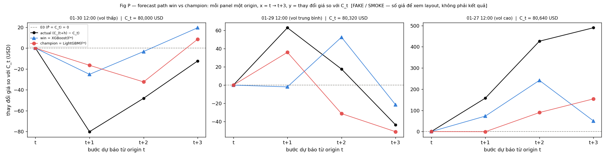
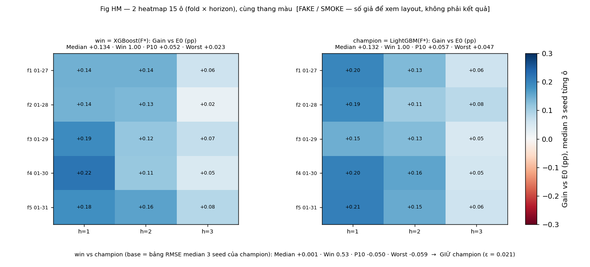
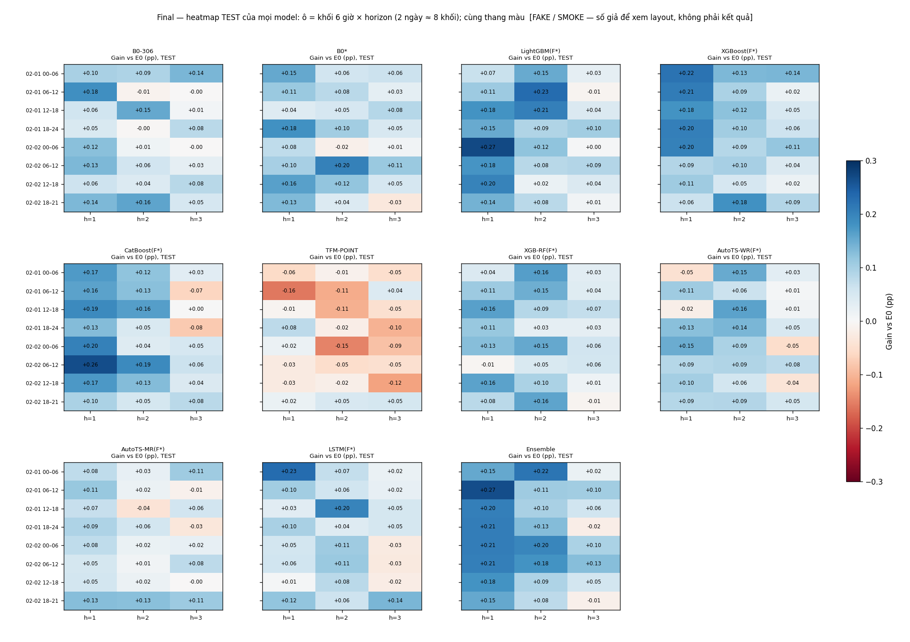
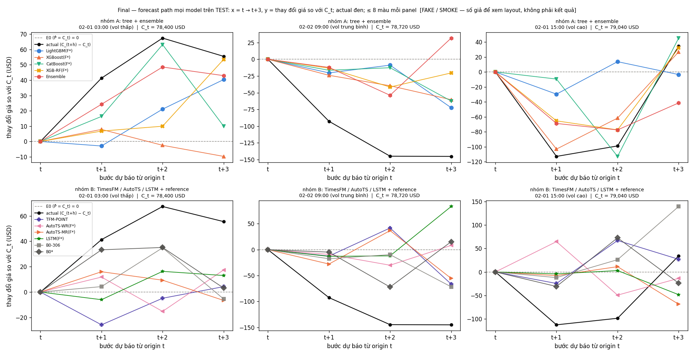
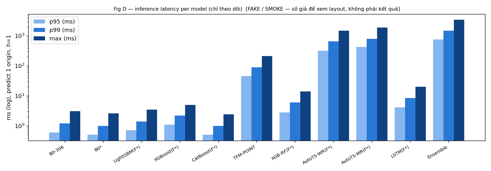

# SMOKE VISUALIZE — layout bảng/figure theo plan (SỐ GIẢ)

> **FAKE / SMOKE — số giả để xem layout, không phải kết quả.** Sinh bởi `reports/smoke_visualize.py` (seed 8586), không đọc data thật, không train gì. Mục đích: thống nhất *hình dạng* output của từng bước trong `docs/RESEARCH_PLAN.md` trước khi code. Mọi con số dưới đây sẽ bị thay bằng kết quả thật khi chạy; không được trích dẫn như finding.

Quy ước chung: prediction là log-return `ŷ_h`, metric tính trên **giá** `P̂ = C_t·exp(ŷ_h)` (USD); `Gain = 1 − RMSE_cand/RMSE_base` tính bằng **pp** (0.100 pp = RMSE thấp hơn base 0.1%); 15 ô = 5 fold × 3 horizon; E0 = dự báo giá không đổi (`P̂ = C_t`). **Chỉ MedianGain (so với ε) là tiêu chí quyết định** ở mọi chỗ — KEEP/DROP, chọn B0\*, win_m, đổi champion, thành viên ensemble; WinRate/P10Gain/WorstGain chỉ báo cáo. PI/MI/standalone chỉ dùng để lập các bộ R1–R4 khi lọc B0 và prune PI cuối vòng lặp. Gộp 3 seed: mỗi configuration có 3 bảng RMSE 15 ô (một mỗi seed); **mỗi ô lấy mean RMSE của 3 seed** → bảng RMSE̅ 15 ô; Gain từng ô = 1 − RMSE̅_A/RMSE̅_B; MedianGain = median của 15 Gain. Training chỉ trên GPU; cột device trong bảng latency là device của lời gọi predict.

## 1. §1.3 — Nhiễu seed ε_m, lịch calibrate, số vòng cố định

| model | std_seed (pp) | ε_m = max(0.005, std) (pp) |
|---|---|---|
| LightGBM | 0.021 | 0.021 |
| XGBoost | 0.024 | 0.024 |
| CatBoost | 0.019 | 0.019 |
| XGB-RF | 0.015 | 0.015 |
| AutoTS-WR | 0.031 | 0.031 |
| AutoTS-MR | 0.034 | 0.034 |
| LSTM | 0.058 | 0.058 |

**Giải thích.** Mỗi model chạy 3 seed trên feature set của phase (xem lịch calibrate bên dưới); `std_seed` là độ lệch chuẩn của Gain giữa các seed trên 15 ô; `ε_m` là ngưỡng "tệ hơn" dùng cho KEEP/DROP, prune và champion của model đó. LSTM nhiễu seed lớn hơn tree, nên ngưỡng của nó rộng hơn — tự động, không chỉnh tay.

Lịch calibrate số vòng/epoch cố định (mỗi (phase, model) một run ES trên đúng feature set; không dùng chéo):

| phase | feature set | model | run ES | kết quả | dùng cho |
|---|---|---|---|---|---|
| A. Lọc B0 | B0-306 | LightGBM | 1 (seed 8586) | 15fixed_306 + ε_LGBM(B0-306) | 4 run kiểm chứng R1–R4 → B0* |
| B. Feature search | B0* (chung) | LightGBM | 1 | 15fixed_LGBM + ε_LGBM | 39 candidate + prune PI của LightGBM |
| B. Feature search | B0* (chung) | XGBoost | 1 | 15fixed_XGB + ε_XGB | 39 candidate + prune PI của XGBoost |
| B. Feature search | B0* (chung) | CatBoost | 1 | 15fixed_Cat + ε_Cat | 39 candidate + prune PI của CatBoost |
| B. Feature search | B0* (chung) | LSTM | 1 (ES theo epoch) | fixed_epoch_LSTM + ε_LSTM | 39 candidate + prune PI của LSTM |
| B. Feature search | B0* (chung) | XGB-RF / AutoTS / TimesFM | — (cơ chế riêng) | chỉ ε_m (XGB-RF 1 vòng cố định; TimesFM zero-shot; AutoTS config cố định) | vòng lặp riêng của model đó |
| C. Prune PI + win | F*_m và F*_m^prune | từng model | 3 seed mỗi configuration, ES bật | RMSE̅ (mean 3 seed từng ô) → Gain prune vs unprune → MedianGain → win_m (+ số vòng/epoch cho Final) | so với champion (§3), figure §7.3 |

Ví dụ `15fixed_LGBM` (best_iteration mà ES dừng ở run calibrate của LightGBM trên B0*, per fold × horizon; dùng cho cả 39 candidate của LightGBM):

| fold | h=1 | h=2 | h=3 |
|---|---|---|---|
| fold 1 (VAL 01-27) | 298 | 375 | 179 |
| fold 2 (VAL 01-28) | 227 | 206 | 151 |
| fold 3 (VAL 01-29) | 269 | 386 | 295 |
| fold 4 (VAL 01-30) | 263 | 205 | 391 |
| fold 5 (VAL 01-31) | 278 | 359 | 433 |

**Giải thích.** "Số vòng cố định" = chính best_iteration mà early stopping dừng ở run calibrate (không phải ước lượng thống kê). ES trên 1.377 dòng nhiễu, nên chỉ chạy ES một lần cho mỗi (phase, model) rồi cố định cho mọi run của phase đó ⇒ candidate và base cùng số vòng, chênh lệch Gain chỉ do feature. B0* là điểm xuất phát chung: mỗi model có early stopping (LightGBM, XGBoost, CatBoost theo số vòng; LSTM theo số epoch → fixed_epoch_LSTM) tự calibrate một run ES trên B0* → 15fixed_m riêng, rồi tự feature search bằng chính model đó → F*_LGBM, F*_XGB, F*_Cat có thể khác nhau; không model nào kế thừa F* của model khác. 15fixed_306 chỉ dùng cho lọc B0; không dùng số vòng của LightGBM cho model khác.

## 2. §1.4 — Lọc 306 feature B0 → B0\* (`experiments/b0_filter.csv`)

Mẫu 8 dòng (thật sẽ có 306 dòng); mỗi cột có giữ/bỏ riêng cho từng bộ R1–R4:

| cột | base | lag | PI h1/h2/h3 (USD) | SA Gain vs E0 h1/h2/h3 (pp) | SA Gain vs B0-306 (pp, median) | MI − null h1/h2/h3 | PI+ / SA+ / MI+ (≥2/3 h) | R1 | R2 | R3 | R4 |
|---|---|---|---|---|---|---|---|---|---|---|---|
| fine:t:return1 | return1 | 0 | +0.89/+1.03/+0.75 | +0.058/+0.043/+0.021 | -0.147 | +0.0024/+0.0035/+0.0051 | 1 / 1 / 1 | giữ | giữ | giữ | giữ |
| fine:t-1m:return1 | return1 | -1 | +0.90/+0.96/+1.04 | +0.086/+0.057/+0.022 | -0.156 | +0.0040/+0.0034/+0.0045 | 1 / 1 / 1 | giữ | giữ | giữ | giữ |
| fine:t:close_position | close_position | 0 | +0.77/+0.73/+0.70 | +0.021/+0.067/+0.041 | -0.110 | +0.0045/+0.0030/+0.0026 | 1 / 1 / 1 | giữ | giữ | giữ | giữ |
| coarse:t:rv64 | rv64 | 0 | +0.69/+0.78/+0.80 | +0.045/+0.045/+0.054 | -0.135 | +0.0046/+0.0038/+0.0033 | 1 / 1 / 1 | giữ | giữ | giữ | giữ |
| coarse:t-504m:time_of_day_sin | time_of_day_sin | -504 | -0.17/+0.04/-0.32 | +0.004/-0.022/+0.017 | -0.175 | +0.0009/-0.0015/-0.0026 | 0 / 1 / 0 | giữ | bỏ | bỏ | giữ |
| fine:t-63m:minute_mod5_cos | minute_mod5_cos | -63 | -0.40/-0.34/-0.39 | -0.013/-0.037/-0.038 | -0.127 | +0.0002/+0.0002/+0.0007 | 0 / 0 / 1 | giữ | bỏ | bỏ | bỏ |
| coarse:t-256m:sign_flip_rate32 | sign_flip_rate32 | -256 | -0.20/-0.07/+0.31 | -0.013/-0.050/-0.029 | -0.178 | -0.0011/+0.0013/-0.0000 | 0 / 0 / 0 | bỏ | bỏ | bỏ | bỏ |
| origin:rv60 | rv60 | 0 | +0.99/+0.47/+0.53 | +0.067/+0.066/+0.084 | -0.117 | +0.0042/+0.0036/+0.0054 | 1 / 1 / 1 | giữ | giữ | giữ | giữ |

Kiểm chứng 4 bộ so với B0-306 (mỗi bộ 1 run LightGBM gốc, số vòng cố định, seed 8586):

| bộ | luật giữ cột | số cột | MedianGain vs B0-306 (pp) | WinRate | quyết định |
|---|---|---|---|---|---|
| B0-306 | — | 306 | 0.000 | — | reference |
| R1 | PI+ hoặc SA+ hoặc MI+ | 245 | +0.020 | 0.60 | không tệ hơn |
| R2 | PI+ hoặc (SA+ và MI+) | 197 | +0.031 | 0.67 | **B0\*** (không tệ hơn, cao nhất) |
| R3 | PI+ | 143 | −0.044 | 0.33 | tệ hơn −ε_LGBM (−0.021) → loại |
| R4 | SA+ | 88 | −0.090 | 0.20 | loại |

**Giải thích.** Ba điểm số per horizon (median 5 fold): PI = RMSE tăng thêm (USD) khi xáo cột đó trong VAL; SA = standalone, LightGBM chỉ trên một cột, Gain so với E0 và so với B0-306; MI − null = mutual information với z-target trên FIT trừ MI với target xáo trộn. Cờ **PI+ / SA+ / MI+** = điểm số > 0 ở **ít nhất 2 trong 3 horizon** (ví dụ PI > 0 ở h1, h2 nhưng < 0 ở h3 → PI+; chỉ h1 > 0 → không +). Không có tier: bốn bộ định nghĩa thẳng bằng cờ — R1 giữ nếu PI+ hoặc SA+ hoặc MI+ (bỏ cột âm cả ba); R2 giữ nếu PI+ hoặc (SA+ và MI+); R3 giữ nếu PI+; R4 giữ nếu SA+. Chọn B0\* = trong các bộ có MedianGain ≥ −ε_LGBM so với B0-306, lấy bộ MedianGain cao nhất (chênh < ε → bộ nhỏ hơn); không bộ nào đạt → B0\* = B0-306. Nếu một cột đơn lẻ thắng B0-306 (SA Gain vs B0-306 > +ε) thì đó là cờ đỏ B0 bị nhiễu chi phối — không cần luật riêng: R3/R4 sẽ tự thắng ở bước kiểm chứng. Bảng nhóm 38 base feature (gộp 8 lag) đi kèm để đọc, không dùng để quyết định.

## 3. §2.1 — Vòng lặp feature của một model (`experiments/keepdrop_LightGBM.csv`)

Mẫu 8 candidate đầu (thật: 39 dòng/model, mỗi model một file):

| # | cột | MedianGain vs S_m (pp) | WinRate | P10Gain | WorstGain | Gain vs B0* (pp) | Gain vs E0 (pp) | gain_standalone vs E0 (pp) | decision | size S_m sau | exp_id |
|---|---|---|---|---|---|---|---|---|---|---|---|
| 1 | vwap_amt_gap_1 | +0.041 | 0.80 | -0.030 | -0.054 | +0.045 | +0.165 | +0.024 | KEEP | 198 | lgbm_c001 |
| 2 | vwap_amt_gap_15 | +0.012 | 0.53 | -0.057 | -0.083 | +0.019 | +0.140 | +0.010 | KEEP | 199 | lgbm_c002 |
| 3 | vwap_amt_gap_60 | -0.009 | 0.67 | -0.036 | -0.121 | +0.002 | +0.122 | -0.002 | KEEP | 200 | lgbm_c003 |
| 4 | vwap_amt_gap_240 | -0.033 | 0.20 | -0.074 | -0.089 | -0.018 | +0.102 | +0.001 | DROP | 200 | lgbm_c004 |
| 5 | ret_60 | +0.002 | 0.47 | -0.078 | -0.129 | +0.021 | +0.141 | +0.011 | KEEP | 201 | lgbm_c005 |
| 6 | ret_240 | -0.018 | 0.33 | -0.065 | -0.110 | +0.005 | +0.124 | +0.007 | KEEP | 202 | lgbm_c006 |
| 7 | ret_1440 | -0.052 | 0.13 | -0.155 | -0.186 | -0.026 | +0.094 | +0.002 | DROP | 202 | lgbm_c007 |
| 8 | log_rv15_rv240 | +0.024 | 0.67 | -0.028 | -0.051 | +0.054 | +0.174 | +0.015 | KEEP | 203 | lgbm_c008 |

**Giải thích.** Mỗi dòng = một candidate thêm vào bộ hiện tại `S_m` của model (xuất phát chung là B0*); base của Gain là chính model trên `S_m`; số vòng = 15fixed_m của model đó (calibrate trên B0*). Luật: `MedianGain ≥ −ε_m` → KEEP (kể cả gần như không đổi), `< −ε_m` → DROP (ε_LGBM giả = 0.021 pp). Mỗi model có file riêng (keepdrop_XGBoost.csv, keepdrop_CatBoost.csv, …) với cùng cấu trúc; các F*_m có thể khác nhau. `gain_standalone` là diagnostic (LightGBM chỉ trên cột đó vs E0): standalone > 0 nhưng vs S_m ≈ 0 ⇒ có tín hiệu nhưng trùng base. `size S_m sau` (số cột của S_m sau quyết định) cho thấy bộ feature lớn dần. Không còn safety-net; sau vòng lặp chỉ có prune PI (§3b).

### 3b. §2.1 — Prune PI + confirmation 3 seed → win_m

| configuration | 3 seed | RMSE̅ h=1 fold1..5 (USD) | MedianGain prune vs unprune (pp) | quyết định |
|---|---|---|---|---|
| F*_m (unprune, 14 cột ext) | 8586/8587/8588, ES bật | 60.26 / 53.42 / 53.72 / 48.76 / 56.81 | — | — |
| F*_m^prune (bỏ 5 cột ext có PI ≤ 0, còn 9) | 8586/8587/8588, ES bật | 60.26 / 53.41 / 53.73 / 48.76 / 56.82 | -0.000 (Win 0.47 · P10 -0.014 · Worst -0.023) | ≥ −ε_m (−0.024) → **win = prune** |

Minh họa gộp 3 seed (chỉ h=1; thật sẽ là 5 fold × 3 horizon = 15 ô):

| fold | unprune RMSE seed 8586 / 8587 / 8588 (h=1) | RMSE̅ unprune (mean) | prune RMSE seed 8586 / 8587 / 8588 (h=1) | RMSE̅ prune (mean) | Gain_{f,1} = 1 − RMSE̅^prune/RMSE̅^unprune (pp) |
|---|---|---|---|---|---|
| f1 01-27 | 60.26 / 60.26 / 60.26 | 60.26 | 60.25 / 60.26 / 60.27 | 60.26 | -0.003 |
| f2 01-28 | 53.42 / 53.42 / 53.41 | 53.42 | 53.41 / 53.42 / 53.40 | 53.41 | +0.014 |
| f3 01-29 | 53.72 / 53.72 / 53.71 | 53.72 | 53.73 / 53.74 / 53.72 | 53.73 | -0.023 |
| f4 01-30 | 48.77 / 48.75 / 48.76 | 48.76 | 48.78 / 48.75 / 48.75 | 48.76 | -0.000 |
| f5 01-31 | 56.80 / 56.81 / 56.82 | 56.81 | 56.80 / 56.82 / 56.82 | 56.82 | -0.013 |

**Giải thích.** Sau vòng lặp: (a) tính permutation importance trên VAL cho các cột ext của F*_m, bỏ đồng thời mọi cột có PI ≤ 0 → F*_m^prune; (b) mỗi configuration (F*_m và F*_m^prune) chạy 3 seed (ES bật) → 3 bảng RMSE 15 ô; với mỗi ô (f, h) lấy **mean RMSE của 3 seed** → một bảng RMSE̅ 15 ô duy nhất cho mỗi configuration; từng ô `Gain_{f,h} = 1 − RMSE̅^prune_{f,h} / RMSE̅^unprune_{f,h}`; **MedianGain = median của 15 Gain**, so với ngưỡng nhiễu ε_m của model đang xét (WinRate/P10/Worst tính trên cùng 15 ô, chỉ báo cáo). `MedianGain ≥ −ε_m` → win_m = F*_m^prune; thấp hơn → win_m = F*_m (unpruned). Bảng RMSE̅ của win_m là bảng dùng cho champion log và figure; win vs champion dùng cùng cách gộp (RMSE̅ của hai bên → Gain từng ô → median).

## 4. §3 — Champion log (`experiments/champion_log.csv`)

| model (win_m) | F*_m (cột ext sau prune) | champion trước | MedianGain vs champion (pp, từ RMSE̅ mean 3 seed) | WinRate | P10Gain | WorstGain | ε_champion | decision | MedianGain vs E0 | latency p95 h1 (ms) | champion sau |
|---|---|---|---|---|---|---|---|---|---|---|---|
| LightGBM(F*) | 9 | — | — | — | — | — | 0.021 | champion ban đầu (§3) | +0.137 | 0.70 | LightGBM(F*) |
| XGBoost(F*) | 17 | LightGBM(F*) | -0.001 | 0.47 | -0.052 | -0.056 | 0.021 | giữ | +0.135 | 1.10 | LightGBM(F*) |
| CatBoost(F*) | 16 | LightGBM(F*) | -0.029 | 0.20 | -0.071 | -0.074 | 0.021 | giữ | +0.099 | 0.50 | LightGBM(F*) |
| TFM-POINT | — | LightGBM(F*) | -0.169 | 0.00 | -0.237 | -0.280 | 0.021 | giữ | -0.031 | 45.00 | LightGBM(F*) |
| XGB-RF(F*) | 8 | LightGBM(F*) | -0.047 | 0.07 | -0.085 | -0.093 | 0.021 | giữ | +0.077 | 2.80 | LightGBM(F*) |
| AutoTS-WR(F*) | 14 | LightGBM(F*) | -0.059 | 0.00 | -0.108 | -0.115 | 0.021 | giữ | +0.067 | 320.00 | LightGBM(F*) |
| AutoTS-MR(F*) | 8 | LightGBM(F*) | -0.065 | 0.00 | -0.146 | -0.159 | 0.021 | giữ | +0.049 | 420.00 | LightGBM(F*) |
| LSTM(F*) | 14 | LightGBM(F*) | -0.064 | 0.00 | -0.111 | -0.133 | 0.021 | giữ | +0.063 | 4.10 | LightGBM(F*) |
| Ensemble | 7 thành viên, equal | LightGBM(F*) | -0.009 | 0.40 | -0.036 | -0.052 | 0.021 | giữ | +0.115 | 749.20 | LightGBM(F*) |

**Giải thích.** Champion ban đầu = LightGBM code gốc trên win_LGBM (dòng đầu, không so sánh). Sau khi mỗi model có win_m, tính từng ô Gain = 1 − RMSE̅_win/RMSE̅_champion với RMSE̅ = bảng mean 3 seed của mỗi bên (cùng cách gộp như prune) → MedianGain = median 15 Gain; `MedianGain > +ε_champion` → đổi champion, ngược lại giữ — cả hai trường hợp đều ghi một dòng và vẽ figure §7.3 (win vs champion). Ensemble xét cuối cùng, cùng luật (ở mẫu này Ensemble thắng ⇒ champion cuối = Ensemble). Thành viên ensemble theo luật §3 = champion + mọi model có MedianGain vs E0 > 0: LightGBM(F*), XGBoost(F*), CatBoost(F*), XGB-RF(F*), AutoTS-WR(F*), AutoTS-MR(F*), LSTM(F*) (TFM-POINT bị loại vì < 0; B0-306/B0\* là reference). Trọng số: (a) đều, (b) 1/MSE_VAL per horizon — với chênh lệch RMSE ~0.1% thì (b) ≈ (a). Cột latency chỉ là thông tin (§7.4), không phải tiêu chí.

## 5. §7.2 — Bảng tổng hợp mọi model (`experiments/summary/all_models.csv`)

### 5.1 VAL (5 fold; RMSE/MAE = trung bình fold của bảng RMSE̅ mean 3 seed; Gain 15 ô từ RMSE̅)

| model | RMSE h1 (USD) | MAE h1 | r h1 | dir-acc h1 | Gain vs E0 h1 (pp) | RMSE h2 (USD) | MAE h2 | r h2 | dir-acc h2 | Gain vs E0 h2 (pp) | RMSE h3 (USD) | MAE h3 | r h3 | dir-acc h3 | Gain vs E0 h3 (pp) | MedianGain vs B0-306 (pp) | WinRate vs B0-306 | MedianGain vs champion (pp) | P10 vs champion | Worst vs champion |
|---|---|---|---|---|---|---|---|---|---|---|---|---|---|---|---|---|---|---|---|---|
| E0 | 54.7 | 41.0 | -0.002 | 0.504 | +0.000 | 83.6 | 59.2 | 0.004 | 0.499 | +0.000 | 106.9 | 75.9 | -0.006 | 0.496 | +0.000 | -0.063 | 0.07 | -0.137 | -0.201 | -0.207 |
| B0-306 | 54.6 | 40.1 | 0.039 | 0.516 | +0.102 | 83.5 | 58.9 | 0.045 | 0.522 | +0.075 | 106.9 | 71.9 | 0.031 | 0.513 | +0.031 | +0.000 | 0.00 | -0.065 | -0.104 | -0.118 |
| B0* | 54.6 | 39.4 | 0.050 | 0.518 | +0.123 | 83.5 | 58.0 | 0.043 | 0.521 | +0.105 | 106.9 | 78.7 | 0.026 | 0.517 | +0.024 | +0.019 | 0.73 | -0.044 | -0.084 | -0.098 |
| LightGBM(F*) | 54.6 | 39.9 | 0.067 | 0.526 | +0.197 | 83.5 | 57.9 | 0.055 | 0.521 | +0.137 | 106.9 | 81.5 | 0.031 | 0.514 | +0.058 | +0.065 | 1.00 | +0.000 | +0.000 | +0.000 |
| XGBoost(F*) | 54.6 | 37.8 | 0.064 | 0.523 | +0.184 | 83.5 | 60.5 | 0.051 | 0.518 | +0.135 | 106.9 | 71.2 | 0.033 | 0.525 | +0.057 | +0.060 | 1.00 | -0.001 | -0.052 | -0.056 |
| CatBoost(F*) | 54.6 | 40.5 | 0.054 | 0.525 | +0.168 | 83.5 | 60.1 | 0.047 | 0.517 | +0.099 | 106.9 | 78.6 | 0.022 | 0.506 | +0.021 | +0.039 | 0.60 | -0.029 | -0.071 | -0.074 |
| TFM-POINT | 54.7 | 41.8 | 0.003 | 0.496 | -0.043 | 83.6 | 61.8 | 0.005 | 0.502 | -0.037 | 107.0 | 78.3 | -0.002 | 0.499 | -0.028 | -0.108 | 0.00 | -0.169 | -0.237 | -0.280 |
| XGB-RF(F*) | 54.6 | 40.3 | 0.046 | 0.520 | +0.128 | 83.5 | 59.1 | 0.043 | 0.516 | +0.099 | 106.9 | 79.1 | 0.034 | 0.511 | +0.057 | +0.026 | 0.87 | -0.047 | -0.085 | -0.093 |
| AutoTS-WR(F*) | 54.6 | 41.7 | 0.038 | 0.512 | +0.095 | 83.5 | 57.2 | 0.034 | 0.512 | +0.067 | 106.9 | 77.2 | 0.025 | 0.512 | +0.032 | +0.003 | 0.53 | -0.059 | -0.108 | -0.115 |
| AutoTS-MR(F*) | 54.7 | 40.9 | 0.028 | 0.511 | +0.049 | 83.5 | 58.1 | 0.030 | 0.510 | +0.057 | 106.9 | 80.6 | 0.028 | 0.514 | +0.030 | -0.003 | 0.47 | -0.065 | -0.146 | -0.159 |
| LSTM(F*) | 54.6 | 38.5 | 0.045 | 0.516 | +0.081 | 83.5 | 59.6 | 0.044 | 0.524 | +0.068 | 106.9 | 73.5 | 0.026 | 0.508 | +0.034 | +0.004 | 0.53 | -0.064 | -0.111 | -0.133 |
| Ensemble | 54.6 | 38.8 | 0.068 | 0.525 | +0.222 | 83.5 | 60.9 | 0.053 | 0.520 | +0.115 | 106.9 | 76.3 | 0.028 | 0.511 | +0.035 | +0.066 | 0.80 | -0.009 | -0.036 | -0.052 |

### 5.2 TEST 2 ngày (§4, một block; refit trên FIT → 01-30, ES 01-31)

| model | RMSE h1 (USD) | MAE h1 | r h1 | dir-acc h1 | Gain vs B0-306 h1 (pp) | Gain vs E0 h1 (pp) | RMSE h2 (USD) | MAE h2 | r h2 | dir-acc h2 | Gain vs B0-306 h2 (pp) | Gain vs E0 h2 (pp) | RMSE h3 (USD) | MAE h3 | r h3 | dir-acc h3 | Gain vs B0-306 h3 (pp) | Gain vs E0 h3 (pp) |
|---|---|---|---|---|---|---|---|---|---|---|---|---|---|---|---|---|---|---|
| E0 | 62.3 | 46.4 | -0.004 | 0.502 | -0.068 | +0.000 | 58.6 | 43.8 | 0.005 | 0.501 | -0.053 | +0.000 | 125.0 | 89.7 | -0.003 | 0.498 | -0.066 | +0.000 |
| B0-306 | 62.3 | 46.3 | 0.038 | 0.514 | +0.000 | +0.068 | 58.6 | 40.8 | 0.031 | 0.514 | +0.000 | +0.053 | 125.0 | 89.0 | 0.046 | 0.517 | +0.000 | +0.066 |
| B0* | 62.3 | 42.2 | 0.045 | 0.521 | +0.017 | +0.085 | 58.6 | 41.4 | 0.042 | 0.516 | +0.037 | +0.091 | 125.0 | 88.0 | 0.016 | 0.508 | -0.064 | +0.003 |
| LightGBM(F*) | 62.2 | 45.2 | 0.056 | 0.521 | +0.124 | +0.191 | 58.6 | 42.8 | 0.039 | 0.510 | +0.015 | +0.068 | 124.9 | 91.4 | 0.038 | 0.515 | +0.020 | +0.086 |
| XGBoost(F*) | 62.2 | 43.7 | 0.058 | 0.525 | +0.112 | +0.180 | 58.5 | 40.5 | 0.056 | 0.525 | +0.081 | +0.134 | 125.0 | 87.9 | 0.022 | 0.509 | -0.033 | +0.034 |
| CatBoost(F*) | 62.2 | 45.0 | 0.055 | 0.525 | +0.110 | +0.178 | 58.5 | 42.4 | 0.058 | 0.525 | +0.099 | +0.152 | 125.0 | 94.0 | 0.034 | 0.510 | -0.014 | +0.052 |
| TFM-POINT | 62.3 | 46.1 | -0.002 | 0.499 | -0.087 | -0.019 | 58.6 | 42.1 | 0.008 | 0.505 | -0.068 | -0.015 | 125.1 | 93.1 | -0.001 | 0.494 | -0.108 | -0.042 |
| XGB-RF(F*) | 62.3 | 47.6 | 0.045 | 0.525 | +0.046 | +0.114 | 58.6 | 41.4 | 0.045 | 0.521 | +0.034 | +0.087 | 125.0 | 86.7 | 0.017 | 0.503 | -0.050 | +0.017 |
| AutoTS-WR(F*) | 62.3 | 44.1 | 0.035 | 0.517 | -0.005 | +0.063 | 58.6 | 42.2 | 0.039 | 0.515 | +0.044 | +0.098 | 124.9 | 89.1 | 0.049 | 0.519 | +0.039 | +0.106 |
| AutoTS-MR(F*) | 62.3 | 44.8 | 0.042 | 0.517 | +0.017 | +0.085 | 58.6 | 42.0 | 0.019 | 0.505 | -0.028 | +0.026 | 125.0 | 90.9 | 0.022 | 0.516 | -0.036 | +0.030 |
| LSTM(F*) | 62.3 | 45.6 | 0.041 | 0.518 | +0.037 | +0.105 | 58.6 | 39.2 | 0.030 | 0.511 | +0.015 | +0.069 | 124.9 | 86.5 | 0.045 | 0.513 | +0.031 | +0.097 |
| Ensemble | 62.2 | 45.8 | 0.065 | 0.524 | +0.126 | +0.193 | 58.6 | 43.8 | 0.048 | 0.522 | +0.054 | +0.107 | 125.0 | 86.5 | 0.025 | 0.510 | -0.034 | +0.032 |

**Giải thích.** RMSE/MAE tính trên giá (USD) — với BTC ~80k và std return 1 phút ~0.077%, E0 ở h=1 cỡ 60 USD, h=3 cỡ 105 USD. Tín hiệu 1 phút rất nhỏ nên Gain thật chỉ cỡ 0.05–0.3 pp; Gain > ~1 pp là dấu hiệu leakage/bug. `r` và `dir-acc` tính trên thay đổi giá `P̂ − C_t` vs `C_{t+h} − C_t` (dir-acc bỏ bar giá không đổi). TFM-POINT zero-shot ở mẫu này thua E0 (Gain âm) ⇒ theo plan sẽ không chạy LoRA. TEST chỉ xem một lần, không sửa gì sau đó.

## 6. §7.3 — Figure

Màu: **actual luôn đen**; ảnh so sánh win vs champion dùng màu theo vai trò — win = blue `#2a78d6` ▲, champion = red `#e34948` ● (cặp xa nhau nhất), E0 = xám nét đứt. Ảnh nhiều model dùng màu/marker cố định cho từng model (palette categorical đã validate bằng validator của skill dataviz, thứ tự slot cố định, không xoay vòng; tối đa 8 màu mỗi panel — vượt thì tách nhóm): LightGBM(F*) = #2a78d6 `o`; XGBoost(F*) = #eb6834 `^`; CatBoost(F*) = #1baf7a `v`; XGB-RF(F*) = #eda100 `X`; Ensemble = #e34948 `h`; TFM-POINT = #4a3aa7 `P`; AutoTS-WR(F*) = #e87ba4 `<`; AutoTS-MR(F*) = #eb6834 `>`; LSTM(F*) = #008300 `*`; B0-306 = #898781 `s`; B0* = #52514e `D`. Heatmap diverging xanh↔đỏ, cùng thang màu khi so sánh.

### 6.1 Sau mỗi model — win_m vs champion hiện tại: 1 ảnh forecast path (3 origin) + 2 heatmap

**Giải thích.** Fig P (forecast path): mỗi panel là **MỘT origin t**; trục x = `t, t+1, t+2, t+3`, trục y = **thay đổi giá so với `C_t`** (USD). Đường đen = actual `[0, C_(t+1)−C_t, C_(t+2)−C_t, C_(t+3)−C_t]`; hai đường màu = prediction của win và của champion `[0, P̂_(t+h)−C_t]` với `P̂_(t+h) = C_t·exp(ŷ_h)`; đường xám ngang 0 = E0 (`P̂ = C_t`). Ba origin lấy ở **3 ngày VAL/fold khác nhau** đại diện biến động thấp / trung bình / cao (xếp 5 ngày VAL theo std r1 trong ngày, lấy min / trung vị / max), mỗi ngày dùng **origin cố định đầu tiên ≥ 12:00 UTC** — chọn theo quy tắc cố định, không chọn theo error/prediction. Fig HM: 2 heatmap 15 ô (fold × horizon) của win và champion, giá trị = Gain vs E0 tính từ bảng RMSE̅ mean 3 seed, cùng thang màu; tiêu đề ghi MedianGain/WinRate/P10/Worst và kết quả win vs champion. Ở mẫu này prediction được vẽ với biên độ lớn hơn thực tế để nhìn rõ layout — với tín hiệu thật (~0.1–0.2 pp) đường prediction sẽ nằm rất sát 0; đó là bình thường.

### 6.2 Final (TEST) — heatmap của mọi model + forecast path của mọi model

**Giải thích.** Heatmap TEST: ô = khối 6 giờ × horizon (2 ngày ≈ 8 khối), giá trị Gain vs E0, một panel mỗi model (B0-306, B0*, mọi win_m, ensemble), cùng thang màu. Forecast path Final: cùng định nghĩa Fig P nhưng vẽ prediction của **tất cả model trên cùng một origin**; 3 origin lấy từ 3 khối 60 origin không chồng nhau trong TEST có std r1 thấp nhất / trung vị / cao nhất (origin đại diện = origin đầu khối); tách 2 hàng (nhóm A tree + ensemble; nhóm B TimesFM/AutoTS/LSTM + reference) để mỗi panel ≤ 8 màu; actual đen ở mọi panel.

## 7. §7.4 — Inference latency (chỉ theo dõi) (`experiments/summary/latency_summary.csv`)

| model | h | p95 (ms) | p99 (ms) | max (ms) | shared | train device | predict device |
|---|---|---|---|---|---|---|---|
| B0-306 | 1 | 0.60 | 1.20 | 3.10 | false | GPU | CPU (LightGBM predict) |
| B0-306 | 2 | 0.65 | 1.30 | 3.35 | false | GPU | CPU (LightGBM predict) |
| B0-306 | 3 | 0.70 | 1.39 | 3.60 | false | GPU | CPU (LightGBM predict) |
| B0* | 1 | 0.50 | 1.00 | 2.60 | false | GPU | CPU (LightGBM predict) |
| B0* | 2 | 0.54 | 1.08 | 2.81 | false | GPU | CPU (LightGBM predict) |
| B0* | 3 | 0.58 | 1.16 | 3.02 | false | GPU | CPU (LightGBM predict) |
| LightGBM(F*) | 1 | 0.70 | 1.40 | 3.50 | false | GPU | CPU (LightGBM predict) |
| LightGBM(F*) | 2 | 0.76 | 1.51 | 3.78 | false | GPU | CPU (LightGBM predict) |
| LightGBM(F*) | 3 | 0.81 | 1.62 | 4.06 | false | GPU | CPU (LightGBM predict) |
| XGBoost(F*) | 1 | 1.10 | 2.20 | 5.00 | false | GPU | GPU |
| XGBoost(F*) | 2 | 1.19 | 2.38 | 5.40 | false | GPU | GPU |
| XGBoost(F*) | 3 | 1.28 | 2.55 | 5.80 | false | GPU | GPU |
| CatBoost(F*) | 1 | 0.50 | 1.00 | 2.40 | false | GPU | CPU (CatBoost predict mặc định) |
| CatBoost(F*) | 2 | 0.54 | 1.08 | 2.59 | false | GPU | CPU (CatBoost predict mặc định) |
| CatBoost(F*) | 3 | 0.58 | 1.16 | 2.78 | false | GPU | CPU (CatBoost predict mặc định) |
| TFM-POINT | 1 | 45.00 | 90.00 | 210.00 | true | GPU | GPU |
| TFM-POINT | 2 | 45.00 | 90.00 | 210.00 | true | GPU | GPU |
| TFM-POINT | 3 | 45.00 | 90.00 | 210.00 | true | GPU | GPU |
| XGB-RF(F*) | 1 | 2.80 | 6.00 | 14.00 | false | GPU | GPU |
| XGB-RF(F*) | 2 | 3.02 | 6.48 | 15.12 | false | GPU | GPU |
| XGB-RF(F*) | 3 | 3.25 | 6.96 | 16.24 | false | GPU | GPU |
| AutoTS-WR(F*) | 1 | 320.00 | 650.00 | 1500.00 | true | GPU | CPU pipeline + GPU regression_model |
| AutoTS-WR(F*) | 2 | 320.00 | 650.00 | 1500.00 | true | GPU | CPU pipeline + GPU regression_model |
| AutoTS-WR(F*) | 3 | 320.00 | 650.00 | 1500.00 | true | GPU | CPU pipeline + GPU regression_model |
| AutoTS-MR(F*) | 1 | 420.00 | 800.00 | 1900.00 | true | GPU | CPU pipeline + GPU regression_model |
| AutoTS-MR(F*) | 2 | 420.00 | 800.00 | 1900.00 | true | GPU | CPU pipeline + GPU regression_model |
| AutoTS-MR(F*) | 3 | 420.00 | 800.00 | 1900.00 | true | GPU | CPU pipeline + GPU regression_model |
| LSTM(F*) | 1 | 4.10 | 8.50 | 20.00 | true | GPU | GPU |
| LSTM(F*) | 2 | 4.10 | 8.50 | 20.00 | true | GPU | GPU |
| LSTM(F*) | 3 | 4.10 | 8.50 | 20.00 | true | GPU | GPU |
| Ensemble | 1 | 749.20 | 1469.10 | 3444.90 | false | GPU | tổng các thành viên (CPU+GPU) |
| Ensemble | 2 | 809.14 | 1586.63 | 3720.49 | false | GPU | tổng các thành viên (CPU+GPU) |
| Ensemble | 3 | 869.07 | 1704.16 | 3996.08 | false | GPU | tổng các thành viên (CPU+GPU) |

**Giải thích.** Thời gian gọi `predict` cho **một origin** (batch 1), đo ở pass riêng sau khi train (win và Final), bỏ 50 lần đầu warm-up, GPU có `cuda.synchronize`; báo cáo p95/p99/max (p50 không cần). Tree đo riêng từng h (3 model); `shared = true` nghĩa là một lần gọi ra cả 3 bước (LSTM/TimesFM/AutoTS) nên h=1,2,3 cùng giá trị. `train device` luôn GPU (cấm training CPU); `predict device` là device thực tế của lời gọi predict: LightGBM và CatBoost predict trên CPU là đặc tính thư viện (GPU chỉ dùng khi train), XGBoost/LSTM/TimesFM predict trên GPU, AutoTS chạy pipeline CPU quanh regression_model GPU. Chưa gồm thời gian tính feature. Không ảnh hưởng training/loss/quyết định.

## 8. Cách sinh số giả (để không nhầm với kết quả)

- RMSE E0 per (fold, h) = 80.000 × 0.000765 × √h × (1 ± 15% nhiễu); RMSE model per seed = E0 × (1 − skill/100) với skill giả gán sẵn (LightGBM 0.18/0.12/0.05 pp, TFM-POINT âm, Ensemble cao nhất) + nhiễu ô 0.02 pp + nhiễu seed 0.015 pp; 3 seed → mean RMSE từng ô → Gain.
- Prune giả: RMSE prune = RMSE unprune × (1 − g/100), g ~ N(0.006, 0.02) mỗi ô mỗi seed. Cửa sổ vol thấp/trung bình/cao: std r1 × 0.6 / 1.0 / 1.6.
- MAE = 0.72·RMSE; r ≈ √(2·Gain_vs_E0); dir-acc ≈ 0.5 + 0.4·r; latency, PI, MI, standalone, prune đều là hằng số + nhiễu.
- Origin trong Fig P: C_t cố định, C_(t+1..t+3) = C_t·exp(cumsum(r)) với r ~ N(0, σ); prediction = C_t·exp(strength·y_thật + noise), strength 0.05–0.32 (cao hơn thực tế nhiều lần, chỉ để nhìn layout).
- Seed 8586; chạy lại cho cùng số. Khi có pipeline thật, script này bị thay bằng `src/plots.py` + log thật.
